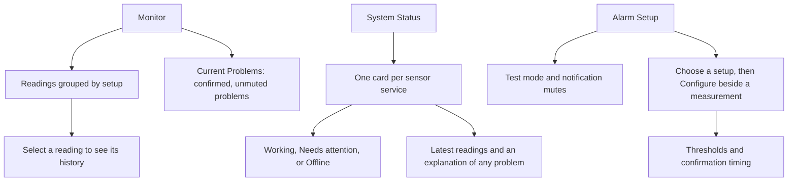

# Dashboard walkthrough

[Installation](INSTALLATION.md) → **Dashboard walkthrough** → [First sensor](FIRST_SENSOR.md) → [Configuration](CONFIGURATION.md)

With LabPulse installed, use this walkthrough to explore the dashboard,
check a reading, and try an alarm with simulated data. If you haven't installed
it yet, follow [Installation](INSTALLATION.md) and choose the simulated setup.

## Three words you'll see often

Imagine an Arduino connected to a pressure sensor and a temperature sensor:

| Word | What it means | In this example |
|---|---|---|
| **Service** | One source of readings, handled by its own running program | The Arduino sensor hub |
| **Measurement** | One reading from that source | Pressure, or temperature |
| **Setup** | A group on the dashboard, usually an experiment or lab system | Compressed Air |

A setup can contain readings from several devices. For example, an experiment
might need pressure from one Arduino and water temperature from another.

You'll also see **driver**: the bit of software that knows how to read a
particular device or message format. You select it in the configuration; most
users won't need to write one.

## Before you begin

You should have completed Home Assistant onboarding, connected its MQTT
integration, and checked the simulated installation. Open the **LabPulse**
dashboard from the Home Assistant sidebar.

Use a new simulated installation for the exercise below. It uses the starter's
pressure reading and temporarily changes its alarm settings. Keep **Test
mode** and **Mute all notifications** on throughout. Simulation also forces
SMS into dry-run mode, so no text messages are sent.

## Find your way around

These are maps of the main pages, not screenshots. The labels come from the
current dashboard; the arrangement depends on your screen size and settings.



**Monitor** is the page to leave open during the day. **System Status** helps
you check that readings are getting through. **Alarm Setup** is where you
decide when a reading should count as a problem and who should hear about it.

### 1. Find a reading

Open **Monitor** and find **Compressed Air**, then its pressure reading. With
the unchanged starter configuration, simulated pressure is around **1.2 bar**.
It should vary a little over time.

> **Screenshot to add: Monitor (simulated installation).** Show Compressed Air
> and its pressure reading using the starter configuration in fake-hardware
> mode. Identify the reading to select for history.

Select the reading to open its history. A new installation only has a short
history; the graph fills up as LabPulse runs. Some simulated readings, such as
digital inputs, stay constant. That doesn't mean they've stopped updating.

### 2. Check the service

Open **System Status** and find **Compressed Air and Environment Sensor Hub**.
It should say **Working** and show pressure, temperature, and humidity.
The System Status tab may appear as a heart/pulse icon.

> **Screenshot to add: System Status.** Show the Compressed Air and Environment
> Sensor Hub reporting Working, with its latest readings. Mark the service
> name, status, and reading timestamps.

If it says **Offline** or **Needs attention**, read the explanation on the
card. Resolve that before trying the alarm exercise; start with
[Troubleshooting](TROUBLESHOOTING.md) if you need help.

### 3. Make a practice alarm

Open **Alarm Setup** and select **Configure** beside **Compressed Air**. On the
setup page, select **Configure** beside pressure. Write down the existing
settings before changing them. The controls
take effect as you change them; **Close** folds the controls away rather than
saving a batch of changes.

> **Screenshot to add: Alarm Setup.** Open the Compressed Air setup and expand
> Configure beside pressure. Mark Alarm mode, Maximum threshold, and the three
> confirmation-timing controls. Keep private recipient details out of the image.

Use these settings for this exercise only:

| Control | Practice setting | What it does |
|---|---|---|
| Alarm mode | High Only | Look for pressure above a maximum |
| Maximum threshold | 0.5 bar | Put the limit below the simulated reading |
| Recovery deadband | 0 bar | Recover once pressure is at or below the maximum |
| Required danger | 70% | Require danger for most of the observation window |
| Observation window | 120 seconds | Look back over the last two minutes |
| Required recovery | 120 seconds | Wait for two minutes of safe readings before clearing |

Keep the notification mutes on. Watch the alarm state on the measurement's
setup page. The value is already above the limit, but the state won't
necessarily change immediately: LabPulse needs enough time outside the limit.
With a full two-minute window, 70% means 84 seconds in danger. Allow a few
minutes because Home Assistant updates the history calculation periodically.

If it still hasn't changed, check that pressure is current, **Alarm mode** is
**High Only**, and the maximum is **0.5 bar**. Keep the mutes on; they don't
prevent the alarm state changing. Then use
[alarm troubleshooting](TROUBLESHOOTING.md#an-alarm-does-not-trigger-or-recover)
if needed.

You should see **Danger**. The service can still say **Working**: it is
successfully reporting a value which you've deliberately made unacceptable.
Global mute blocks notifications, but the alarm can still appear in
**Current Problems**. Muting the measurement or its setup hides it from that
card too. You can always check the alarm state on the measurement's setup page.

### 4. Let it recover

Change **Maximum threshold** to **2 bar** and leave the other practice settings
as they are. The simulated pressure is now safely below the maximum. After it
stays there for the recovery period, the alarm should return to **Normal**.

Restore the settings you wrote down. If you started with **Disabled**, restore
the thresholds and timing first, then select **Disabled**. Leave **Test mode**
and **Mute all notifications** on until you're ready to test notifications
deliberately.

The numbers above are for learning with simulated data. Choose real alarm
limits from your equipment's requirements, not from this exercise.

### 5. Know what you've checked

You've seen readings arrive, opened their history, checked service status, and
watched an alarm enter and leave Danger. That checks the software path using
simulated values. It doesn't check sensor wiring, calibration, or real SMS
delivery.

To stop the demo, run this **in the Pi's terminal**:

```bash
labpulse down
```

Your settings and history stay on the Pi. Start it again with `labpulse up`.
Test mode turns on again whenever Home Assistant starts.

## Where to go next

- [Connect your first sensor](FIRST_SENSOR.md) walks through one Arduino
  pressure reading, from serial output to the dashboard.
- [Hardware](HARDWARE.md) explains which connections are supported and where
  you'll need wiring or calibration information for your particular equipment.
- [The User Guide](USER_GUIDE.md) covers everyday use, notification controls,
  backups, and recovery.
- After your first sensor, [Configuration](CONFIGURATION.md) completes the
  first-time path: adapt the examples to describe your own installation.
