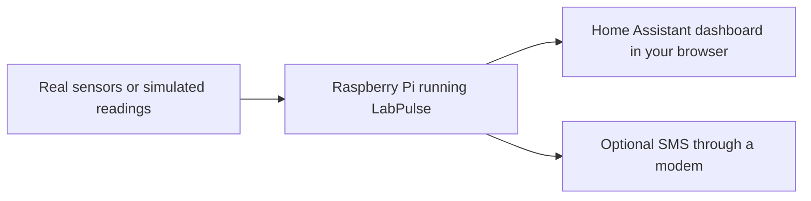

# LabPulse Installation Guide

This guide takes you from a blank Raspberry Pi to a working LabPulse
dashboard. You can start with simulated readings or connect real sensors.
Both use the same configuration and Home Assistant interface.

**Installation** → [Dashboard walkthrough](DASHBOARD_WALKTHROUGH.md) → [First sensor](FIRST_SENSOR.md) → [Configuration](CONFIGURATION.md)

LabPulse installs with pipx and runs its services in Docker containers. You do
not need a repository checkout or a local container build. For everyday use
after installation, read the [User Guide](USER_GUIDE.md).

For your first session, follow **Get onto the Pi → Prepare the Pi → Install LabPulse → Create a
simulated installation → Open Home Assistant → Check the installation**.
You can leave real sensors, SMS, and the reference sections for later.

## Contents

- [What you're installing](#what-youre-installing)
- [Requirements](#requirements)
- [What needs installing?](#what-needs-installing)
- [Get onto the Pi](#get-onto-the-pi)
- [Prepare the Pi](#prepare-the-pi)
- [Install LabPulse](#install-labpulse)
- [Create a simulated installation](#create-a-simulated-installation)
- [Create a real-hardware installation](#create-a-real-hardware-installation)
- [Open Home Assistant](#open-home-assistant)
- [Check the installation](#check-the-installation)
- [Changing the configuration](#changing-the-configuration)
- [Switching between simulated and real hardware](#switching-between-simulated-and-real-hardware)
- [Updating](#updating)
- [Backups and restoring on a new Pi](#backups-and-restoring-on-a-new-pi)
- [Troubleshooting](#troubleshooting)

## What you're installing

The **Raspberry Pi** is the small computer that runs LabPulse. It stays on in
the lab and collects readings. Your laptop or desktop only needs a browser to
view them; closing that browser doesn't stop monitoring.

**Home Assistant** provides the web pages you use. LabPulse adds the lab's
readings, graphs, alarm controls, and status pages to it. You don't need to
build a dashboard yourself.

**Docker** runs the different parts of LabPulse in separate containers. A
container is a packaged program with the software it needs. **MQTT** carries
messages between those programs, and **Mosquitto** is the program that passes
the messages on. You install Docker on the Pi first; `labpulse up` then
downloads and starts Home Assistant, Mosquitto, and the LabPulse workers.

SMS is optional. Reading the dashboard and recording measurements don't need
a modem or SIM card.



## Requirements

The reference system is a Raspberry Pi 5 with 8 GB RAM, running 64-bit
Raspberry Pi OS based on Debian 12 (Bookworm). LabPulse's automated tests cover
Python 3.11 and 3.12. Other Pi models and operating-system versions need their
own deployment checks; 32-bit Raspberry Pi OS is not supported by the published
runtime images.

You will need:

- a Pi, a suitable power supply, and storage for its operating system;
- a working network connection and an account which can use `sudo`;
- Python, pipx, Docker Engine, and the Docker Compose plugin;
- a browser on the Pi or another computer on the same trusted network;
- for real hardware, the connected sensors and their wiring details.

Simulation needs no sensors, modem, or output hardware. Real SMS delivery
additionally needs a supported modem, an active SIM, and ModemManager on the
Pi. Review the [hardware guide](HARDWARE.md) before wiring physical devices.

## What needs installing?

The **host** means Raspberry Pi OS itself, outside Docker. Prepare that first;
LabPulse then sets up the programs which run inside containers.

| Component | How it gets installed | Needed for the simulated demo? |
|---|---|---|
| Raspberry Pi OS, 64-bit Bookworm | Write the OS with Raspberry Pi Imager | Yes |
| Python, pipx, text editor | Install on the Pi with `apt`, below | Yes |
| Docker Engine and Compose plugin | Install on the Pi, below | Yes |
| Clock synchronisation | Enable the Pi's time service; use systemd-timesyncd or chrony | Yes |
| LabPulse command | `pipx install labpulse` | Yes |
| Home Assistant | `labpulse up` downloads and starts its container | Included automatically |
| Mosquitto, the MQTT broker | `labpulse up` downloads and starts its container | Included automatically |
| LabPulse workers and sensor libraries | Downloaded in the LabPulse runtime image by `labpulse up` | Included automatically |
| ModemManager host service | Install with `apt` when preparing real SMS | No |
| I2C interface and Arduino firmware | Enable or upload for the real devices you connect | No |

You do not separately install Home Assistant or Mosquitto with `apt` or `pip`,
and you do not need Home Assistant's Mosquitto add-on. You will add the **MQTT
integration** in the Home Assistant browser interface after startup; that
connects Home Assistant to the broker LabPulse has already started.

`labpulse setup` creates the deployment and its managed Python environment.
It does **not** install Docker, OS packages, a time service, or the host
ModemManager service. The steps below cover those host prerequisites.

## Get onto the Pi

If the Pi already runs the OS described above and you can open its terminal,
skip to [Prepare the Pi](#prepare-the-pi).

### Install the operating system

For a fresh installation, you'll also need another computer and a way to
write the Pi's storage, such as a microSD card reader.

**On your own computer**, follow Raspberry Pi's
[getting-started instructions](https://www.raspberrypi.com/documentation/computers/getting-started.html)
to write Raspberry Pi OS to the Pi's storage using Raspberry Pi Imager. Choose
the 64-bit Bookworm version used by the reference setup, rather than assuming
the latest default is the same version. Writing an image erases the selected
storage, so check which card or drive you've selected.

In Imager, choose the model of the Pi that will **boot the new card**. Under
**Raspberry Pi OS (other)**, look for **Raspberry Pi OS (Legacy, 64-bit)**
whose description names **Debian Bookworm**. This is the desktop image used
in this walkthrough; the recommended default may instead be Trixie.

If your work computer cannot run Imager, another Raspberry Pi with a desktop
can write the card through a USB card reader. Install Imager there with
`sudo apt install rpi-imager`. Select only the target Pi's card, identified by
its size and reader, and keep **Exclude system drives** enabled. Do not select
the storage that the running Pi uses, particularly on a live monitoring unit.

Choose **Raspberry Pi OS with desktop** if you want to open the dashboard on
the Pi's own screen, or **Raspberry Pi OS Lite** if you will use another
computer's browser and manage the Pi through SSH. Either must be 64-bit
Bookworm for this reference procedure. Choose Raspberry Pi OS, not Home
Assistant OS: this deployment needs a normal Linux host for pipx and Docker.

In Imager, set a hostname, create your user account, and configure the network.
Enable SSH if you want to use the Pi from another computer. Keep a note of
the username and hostname you chose. For Wi-Fi, enter its network name,
password, and country; Ethernet can be connected directly. Set your timezone
and keyboard layout. Let Imager finish writing and verifying, safely eject
the storage, insert it into the powered-off Pi, then connect power and let
the Pi boot and join the network.

Give a test Pi a distinct hostname, such as `labpulse-test`, so you can tell it
apart from the live monitor. If you have a screen, keyboard and mouse, you can
skip Wi-Fi customisation and connect through the desktop network menu after
boot, including to a phone hotspot. Remote access needs a working network
connection first.

### Open a terminal

With a keyboard and screen attached to the Pi, open **Terminal** on its
desktop. A terminal is the window where you type commands and read their
results. On a Lite installation, log in at the text prompt instead.

For browser-based shell access, including from home, use
[Raspberry Pi Connect](USER_GUIDE.md#shell-raspberry-pi-connect).

For SSH access on the same network, open PowerShell on Windows or Terminal on macOS/Linux
**on your own computer**. Connect using your Pi's username and hostname:

```bash
ssh YOUR_USERNAME@YOUR_HOSTNAME.local
```

Replace both uppercase placeholders; don't type them literally. For example,
an account named `alex` on a Pi named `labpulse-pi` uses
`ssh alex@labpulse-pi.local`. Check that the address is your Pi before accepting
its first connection prompt. If using password login, the password won't show
as you type. After login, commands in this window run on the Pi.

If the hostname doesn't connect, use the Pi's IP address instead. You can find
it in your router's device list or by running `hostname -I` in a terminal on
the Pi. Raspberry Pi's [remote-access guide](https://www.raspberrypi.com/documentation/computers/remote-access.html)
has more help with addresses and SSH.

### Which computer do I use?

| Task | Where to do it |
|---|---|
| Install LabPulse or run a `labpulse` command | The Pi's terminal, directly, through Raspberry Pi Connect, or over SSH |
| View readings and change alarms | A browser on your own computer or on the Pi |
| Upload Arduino firmware | The computer with the Arduino connected by USB |

In command examples, copy the commands without the surrounding code fences.
`sudo` asks to run a command with administrator privileges; `~` means your
user's home directory. Run commands one at a time and check for errors before
moving on.
Where a code block contains a multi-line command, paste the whole command
together, including its closing line.

## Prepare the Pi

Run these commands in a terminal on the Pi, locally, through Connect, or over SSH. Use
your usual user account for installation and later LabPulse commands.

Keep using that same account: `~/labpulse-live` belongs to the logged-in user's
home directory. Switching accounts changes the default installation path; it
does not stop containers started by another account.

### Update and check the operating system

Check the installed release and architecture:

```bash
cat /etc/os-release
dpkg --print-architecture
```

For this procedure, look for `VERSION_CODENAME=bookworm` and `arm64`.
If these differ, choose the reference OS image before continuing or plan to
validate that other platform separately.

Update the fresh installation, then reboot:

```bash
sudo apt update
sudo apt full-upgrade -y
sudo reboot
```

Reboot closes an SSH or Connect session. Wait for the Pi to return, then
reconnect or open its terminal again. The Pi needs internet access to download
OS packages, the LabPulse package, and container images.

### Install the Python tools

Install Python, pipx, the [Micro text editor](https://github.com/micro-editor/micro),
and the download tools used below:

```bash
sudo apt update
sudo apt install -y python3-full pipx micro ca-certificates curl
pipx ensurepath
```

Open a new terminal, or reconnect over SSH, if `pipx ensurepath` changes your
PATH, the list of places your shell searches for commands. Check that
`python3 --version` reports a supported Python version and `pipx --version`
prints a version number.

If the other tools are already installed, add Micro with `sudo apt install -y
micro`. In Micro, use **Ctrl+S** to save and **Ctrl+Q** to quit.

`labpulse config` automatically chooses Micro when available, unless `VISUAL`
or `EDITOR` already selects another editor. To choose Micro explicitly for the
current terminal session, run:

```bash
export VISUAL=micro
export EDITOR=micro
```

To keep this preference in future Bash sessions, add those two lines to
`~/.bashrc` using `micro ~/.bashrc`. Nano remains a supported fallback.

### Install Docker Engine and Compose

On a fresh 64-bit Bookworm installation, add Docker's Debian package repository
and install its engine and Compose plugin. These commands follow
[Docker's official installation instructions](https://docs.docker.com/engine/install/debian/#install-using-the-apt-repository).
If Docker is already installed, use that guide to check for conflicting
packages before replacing it.

```bash
sudo install -m 0755 -d /etc/apt/keyrings
sudo curl -fsSL https://download.docker.com/linux/debian/gpg -o /etc/apt/keyrings/docker.asc
sudo chmod a+r /etc/apt/keyrings/docker.asc
```

Paste this entire block, including the final `EOF` line. It tells the package
manager where to find Docker for this OS and architecture:

```bash
sudo tee /etc/apt/sources.list.d/docker.sources > /dev/null <<EOF
Types: deb
URIs: https://download.docker.com/linux/debian
Suites: bookworm
Components: stable
Architectures: arm64
Signed-By: /etc/apt/keyrings/docker.asc
EOF
```

Then install and start Docker:

```bash
sudo apt update
sudo apt install -y docker-ce docker-ce-cli containerd.io docker-buildx-plugin docker-compose-plugin
sudo systemctl enable --now docker
```

Verify the installation:

```bash
sudo docker run --rm hello-world
sudo docker compose version
```

The first command should print **Hello from Docker!** and finish. The second
should report a Docker Compose version. If either fails, fix Docker using
[Docker troubleshooting](TROUBLESHOOTING.md#docker-cannot-run) before installing
the LabPulse deployment.

LabPulse normally uses `sudo docker` for container operations. It does not
require membership of the Docker group. If Compose is missing, follow Docker's
[Compose plugin instructions](https://docs.docker.com/compose/install/linux/).

### Set the clock and timezone

LabPulse uses the Pi's clock for reading timestamps and alarms. It needs a
working network time service, but does not specifically require chrony.
The OS time service is sufficient when it synchronises successfully.

Set the Pi's timezone and enable clock synchronisation. Replace
`Europe/London` with the lab's timezone:

```bash
sudo timedatectl set-timezone Europe/London
sudo timedatectl set-ntp true
timedatectl status
```

Check that the time is correct and `System clock synchronized` says `yes`
before testing alarms. Allow a few minutes after connecting to the network.
Use the same timezone in LabPulse's configuration. The
[timedatectl manual](https://manpages.debian.org/bookworm/systemd/timedatectl.1.en.html)
explains these checks.

If enabling NTP reports that it is unsupported, and no other time service is
installed, install and start systemd-timesyncd:

```bash
sudo apt install -y systemd-timesyncd
sudo systemctl enable --now systemd-timesyncd
sudo timedatectl set-ntp true
timedatectl status
```

If your lab uses **chrony**, it can provide synchronisation instead. Use this
alternative rather than installing both time services:

```bash
sudo apt install -y chrony
sudo systemctl enable --now chrony
chronyc tracking
chronyc sources -v
timedatectl status
```

Look for a selected source marked `*` and a normal leap status in the
[chrony reports](https://manpages.debian.org/bookworm/chrony/chronyc.1.en.html).
If no source becomes available, check network access and ask your lab's IT
team which NTP server to use. With chrony, server settings belong in
`/etc/chrony/chrony.conf`; restart `chrony` after changing them. Installing a
time service alone does not prove the clock is synchronised.

### Optional: prepare a modem for real SMS

Skip this section for fake-hardware mode or while using SMS dry-run. For real
SMS, connect the supported modem with its SIM and antenna, then run:

```bash
sudo apt install -y modemmanager
sudo systemctl enable --now ModemManager
sudo mmcli --list-modems
```

Use the modem number printed by that command in `sudo mmcli -m ID`, replacing
`ID` with the number. Check SIM readiness, mobile-network registration and SMS
support. If no modem is listed, resolve that before enabling real delivery;
see [SMS host setup](TROUBLESHOOTING.md#sms-host-setup).

The LabPulse container includes the modem command-line client, but relies on
this host service to control the device. Keep `sms.dry_run: true` until you
are ready to follow [Testing SMS](USER_GUIDE.md#testing-sms).

## Install LabPulse

```bash
pipx install labpulse
labpulse version
labpulse help
```

pipx keeps LabPulse's dependencies in an isolated environment. Run this without
`sudo`; do not install them into the system Python. The LabPulse worker image
is selected to match the installed package version.

You should see a LabPulse version followed by the available commands. If the
shell says `labpulse: command not found`, use the
[pipx and PATH checks](TROUBLESHOOTING.md#pipx-cannot-find-or-install-labpulse).

Choose **one** of the next two paths. To explore the dashboard first, use the
simulated installation.

## Create a simulated installation

```bash
labpulse setup --fake-hardware
labpulse up
```

Setup creates `~/labpulse-live`, copies the starter configuration on a new
installation, and generates the deployment. `labpulse up` downloads missing
images and starts the containers; the first run can take several minutes.

You'll see the same sensors and switches as you would with real hardware.
LabPulse supplies simulated readings, and the switches don't operate any
equipment. SMS runs in dry-run mode: messages are logged but aren't sent.

Continue to [Open Home Assistant](#open-home-assistant). You can edit the
configuration later with `labpulse config`; simulation stays enabled. If the
Pi uses a timezone other than `Europe/London`,
set the matching `timezone` through that editor before checking timestamps.

## Create a real-hardware installation

Connect the hardware and enable required Pi interfaces before starting workers.
For I2C sensors such as SHT40 or X1200, enable I2C through `sudo raspi-config`
as described in the [Pi configuration guide](https://www.raspberrypi.com/documentation/computers/configuration.html#enable-or-disable-i2c),
and follow any reboot prompt. Arduino boards need the matching
[LabPulse firmware](../firmware/README.md).

Create the live directory:

```bash
labpulse setup
```

Setup generates files but does not start the stack. Its starter describes the
example lab, so review it before use:

```bash
labpulse config
```

Select `config.yaml` in the editor menu. Use the
[Configuration reference](CONFIGURATION.md) to:

- set `timezone` to match the Pi;
- keep only the services you need enabled, with at least one enabled service;
- set each driver's port, bus, pin, or other hardware options;
- match measurement names and units to the firmware or data source;
- keep `sms.dry_run: true` while testing, and leave unused outputs disabled.

Find stable serial paths with `ls -l /dev/serial/by-id/` and put the appropriate
path in each service's `driver.options.port`. Alternatively, `labpulse usb`
guides you through unplugging and reconnecting each enabled serial board.
Follow [Assigning serial devices](TROUBLESHOOTING.md#assigning-serial-devices)
to stop workers first and apply the saved mappings afterward.

Saving a changed configuration validates it, generates the deployment, checks
the Home Assistant configuration, and recreates the containers. It can
therefore start real workers immediately. An unchanged edit may exit without
restarting anything. Ensure the stack is running with:

```bash
labpulse up
```

For a Triton control PC, follow the separate [Triton publisher guide](TRITON_PUBLISHER.md)
for its network, credentials, and publisher setup. For a modem, complete
[SMS host setup](TROUBLESHOOTING.md#sms-host-setup) before enabling real delivery.

## Open Home Assistant

On the Pi, run `labpulse open`. Over SSH, open `http://<pi-address>:8123` in a
browser on your own computer. Replace `<pi-address>` with the Pi's network
address, without the angle brackets. For example, if its address is
`192.168.1.50`, open `http://192.168.1.50:8123`. Allow Home Assistant time to
finish startup.

1. Create the Home Assistant account and complete onboarding.
2. Open **Settings → Devices & services**, choose **Add integration**, and
   select [MQTT](https://www.home-assistant.io/integrations/mqtt/#configuration).
3. Set the broker to `127.0.0.1` and port to `1883`. The standard local listener
   does not require a username or password.
4. Open the **LabPulse** dashboard from the sidebar.

Home Assistant connects through the Pi's local address. LabPulse worker
containers use `mosquitto:1883`; keep that hostname in the live configuration.
Once MQTT is connected, the LabPulse sensors and switches should appear
automatically.

Want to check the dashboard from home or your phone outside the lab network?
We recommend **Home Assistant Cloud by Nabu Casa** as the convenient option.
It's an optional paid subscription, configured in **Settings → Home Assistant
Cloud**. Follow [Access from outside the lab](USER_GUIDE.md#access-from-outside-the-lab)
once local access is working.

## Check the installation

```bash
labpulse ps --all
labpulse doctor
```

Doctor should report no failures. Read its warnings and resolve those relevant
to this installation, including host clock and
[watchdog configuration](TROUBLESHOOTING.md#host-clock-or-watchdog-warning).
Then check the dashboard:

1. **System Status** shows the expected services as **Working** and their
   required readings are current.
2. **Monitor** shows the expected setups, readings, and controls. Simulated
   analogue values generally change; digital states may stay constant while
   continuing to publish.
3. **Alarm Setup** has **Mute all notifications** and **Test mode** enabled on
   a new installation. Review thresholds and recipients before unmuting.
4. For real hardware, compare readings with the physical instruments and test
   one failure and recovery. Follow [Testing SMS](USER_GUIDE.md#testing-sms)
   before relying on modem delivery.

Run `labpulse restart`, allow the services to recover, and check again. Test
mode turns on whenever Home Assistant starts; the global mute choice is
restored. Doctor checks installation and connectivity, but cannot prove
calibration or that a text message reached a handset.

Create a [backup](USER_GUIDE.md#backups-and-restoration) once everything is working. To
stop a demonstration without deleting configuration or history, run `labpulse down`.

On the new test Pi, also check startup after a full Pi reboot: with the stack
running, run `sudo reboot`, reconnect, and repeat the checks above. Docker
and the containers should start again without rerunning setup. Containers
stopped with `labpulse down` need `labpulse up` to be created again. A hardware
watchdog is an additional recovery feature for unattended use; its warning
does not prevent a simulated walkthrough, and its setup is covered by the
[watchdog guidance](TROUBLESHOOTING.md#host-clock-or-watchdog-warning).

If you're using simulation, continue with
[Dashboard walkthrough](DASHBOARD_WALKTHROUGH.md#find-your-way-around). It walks
through a reading, its history, and a practice alarm. To connect an Arduino,
use [Connect your first sensor](FIRST_SENSOR.md).

## Changing the configuration

Run `labpulse config` on the Pi to change sensors, recipients, or other file
settings. It edits `~/labpulse-live/config.yaml` and any measurement files
referenced beneath `config.d/`, then checks and applies your changes. Saving a
change can restart the services, so choose a suitable time on a working system.

For alarm thresholds and mutes, use **Alarm Setup** in the browser. For the
editor workflow and files LabPulse generates, see
[Changing the configuration](USER_GUIDE.md#changing-the-configuration).
The [Configuration reference](CONFIGURATION.md) explains the individual fields.

For a different installation directory, put `--live-dir` before the command,
for example `labpulse --live-dir /srv/labpulse setup`. Use that same directory
for subsequent commands, or set `LABPULSE_LIVE_DIR` consistently.

## Switching between simulated and real hardware

Stop the current stack with `labpulse down`. To select simulation, run:

```bash
labpulse setup --fake-hardware
labpulse up
```

To select real hardware, review the configured devices, outputs, and SMS
settings first, then run:

```bash
labpulse setup
labpulse up
```

Setup preserves the live source configuration and Home Assistant private
state. Real mode uses the configured hardware and `sms.dry_run` setting;
simulation's forced dry-run no longer applies. If you need to edit the source
before switching, use `labpulse config` in the current mode, then stop the
stack again before running setup. Repeat the installation checks afterward.

## Updating

Once installed, use `labpulse update` to update both the command and its
deployment. Follow [Updating LabPulse](USER_GUIDE.md#updating-labpulse) for the
backup, notification settings, and checks to make before and after an update.

## Backups and restoring on a new Pi

For routine backups, use [Backups and restoration](USER_GUIDE.md#backups-and-restoration).
Its table lists what the archive includes and what you must save separately.
To rebuild on a replacement Pi, have the archive, the recorded LabPulse version,
and those separate files and setup notes ready.

1. Follow [Get onto the Pi](#get-onto-the-pi) and [Prepare the Pi](#prepare-the-pi).
   Re-establish the required network connections and Pi interfaces.
2. Install the recorded compatible release with `pipx install labpulse==VERSION`,
   replacing `VERSION` with its actual version number. Check `labpulse version`.
   Restore uses this installed package; it won't install the archive's version.
3. Copy the backup to the replacement Pi. For an external MQTT listener, also
   restore its [four security files](TROUBLESHOOTING.md#backup-or-restore-fails)
   to their original live paths and permissions **before** running restore.
4. Reconnect and identify the hardware. Complete the host modem setup if SMS
   is used. Plan for services to start when restoration finishes.
5. Run the command below with the archive's actual path. Check the destination
   in the confirmation prompt before accepting it.

```bash
labpulse restore /path/to/labpulse-backup.tar.gz
```

Restore replaces the selected installation's state, restores the recorded real
or simulated mode, regenerates managed files, starts the stack, and runs
diagnostics. Existing state receives a rollback archive before replacement.

Look for `Restore and post-restore diagnostics completed successfully.`
Then repeat [Check the installation](#check-the-installation), confirm that
the expected history and alarm settings are present, and check notification
routing before returning the Pi to normal use. If the command fails, keep its
output and follow [restore troubleshooting](TROUBLESHOOTING.md#backup-or-restore-fails)
before trying again.

## Troubleshooting

Start with:

```bash
labpulse doctor
labpulse ps --all
labpulse logs --tail 100
```

Use [Troubleshooting](TROUBLESHOOTING.md) for installation failures, missing
devices or readings, generated-file repair, alarms, SMS, and recovery. Edit
the source with `labpulse config`; use the repair procedure when generated
files alone are damaged.

For dashboard and alarm operation, continue with the [User Guide](USER_GUIDE.md).
For a source checkout or local image, use [Development](DEVELOPMENT.md).
To remove the deployment, follow [Removing an installation](USER_GUIDE.md#removing-an-installation).
