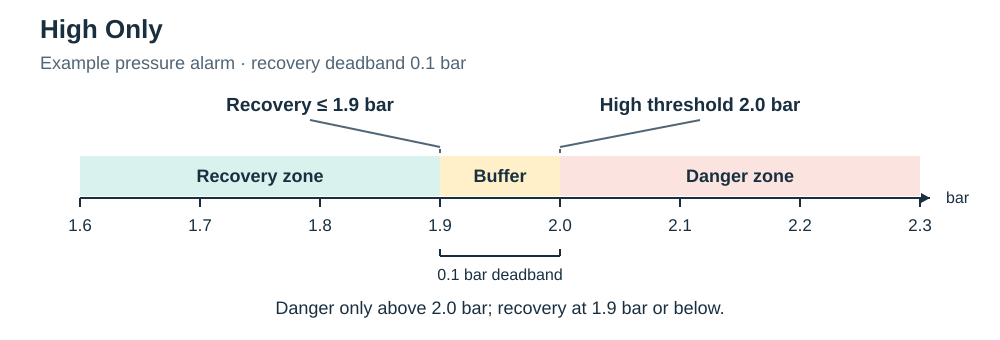
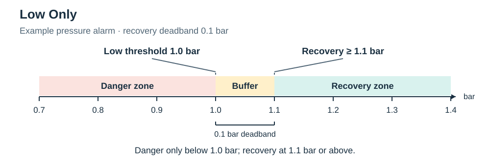
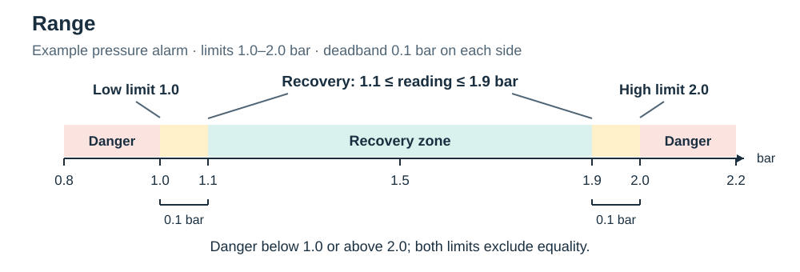
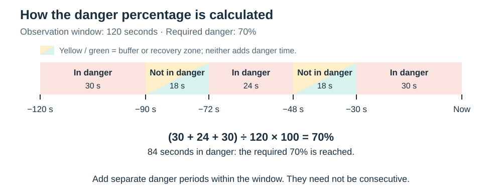
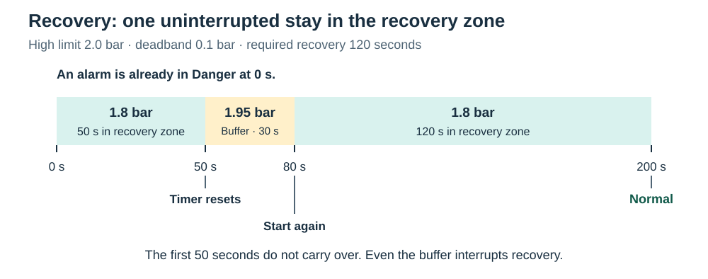

# LabPulse User Guide

This guide is for people using an existing LabPulse installation. It explains
the Home Assistant dashboard, alarms, notifications, simulation, and the
`labpulse` commands used during normal operation.

If you're setting up LabPulse for the first time, start with the
[Installation guide](INSTALLATION.md). For changes to sensors, measurements,
setups, recipients, or other YAML settings, the
[Configuration reference](CONFIGURATION.md) explains each option and includes
examples.

If you haven't used the dashboard yet, try
[Dashboard walkthrough](DASHBOARD_WALKTHROUGH.md). It introduces the main pages and
walks through a practice alarm using simulated data.

> [!IMPORTANT]
> LabPulse is a monitoring aid, not a safety interlock, emergency shutdown
> system, or guaranteed notification channel. Equipment which could cause
> injury, damage, or loss still needs suitable independent protection.

## Contents

- [Start here](#start-here)
- [Access from outside the lab](#access-from-outside-the-lab)
- [Using the dashboard](#using-the-dashboard)
- [Understanding system state](#understanding-system-state)
- [Configuring alarms](#configuring-alarms)
- [Notifications, mutes, and Test mode](#notifications-mutes-and-test-mode)
- [Testing SMS](#testing-sms)
- [Using controlled outputs](#using-controlled-outputs)
- [Everyday commands](#everyday-commands)
- [Changing the configuration](#changing-the-configuration)
- [Using fake hardware](#using-fake-hardware)
- [Updating LabPulse](#updating-labpulse)
- [Backups and restoration](#backups-and-restoration)
- [Removing an installation](#removing-an-installation)
- [Detailed behaviour](#detailed-behaviour)
- [Limitations](#limitations)

## Start here

The normal way to use LabPulse is through Home Assistant. On the Raspberry Pi,
run:

```bash
labpulse open
```

If you are connected to the Pi over SSH, open the following address on another
computer instead:

```text
http://<pi-address>:8123
```

For a quick check of the installation, run:

```bash
labpulse ps --all
labpulse doctor
```

Then check these things in Home Assistant:

1. Open **System Status** and confirm that the expected services say
   **Working**.
2. Open **Monitor** and confirm that the readings are present and continue to
   update.
3. Open **Alarm Setup** and review the thresholds and notification controls.
4. Check the mute and Test mode banners. A healthy dashboard doesn't mean
   notifications are enabled or going to the normal recipients.

When taking over an installation, leave its notification settings as agreed
with the lab. For first-time commissioning, follow [Testing SMS](#testing-sms)
before switching to normal recipients.

If something is missing or unhealthy, start with
[Troubleshooting](TROUBLESHOOTING.md).

## Access from outside the lab

Use **Nabu Casa** for the Home Assistant dashboard and **Raspberry Pi Connect**
for the Pi's command line, where you run `labpulse` commands.

### Dashboard: Nabu Casa

For convenient access from home or your phone, we recommend **Home Assistant
Cloud by Nabu Casa**. It gives you a secure remote address for the same Home
Assistant dashboard you use in the lab. It's an optional paid subscription;
LabPulse and the local dashboard work without it. See
[Home Assistant Cloud](https://www.home-assistant.io/cloud/) for details.

Set it up while you can reach Home Assistant locally:

1. Open **Settings → Home Assistant Cloud** and sign in or create a Nabu Casa
   account.
2. Enable **Remote access**. Allow a little time for the remote address to be
   prepared.
3. Open that address from your other device and sign in with your Home Assistant
   account. Bookmark it for future visits.

The [official setup guide](https://support.nabucasa.com/hc/en-us/articles/26474279202973-Enabling-remote-access-to-Home-Assistant)
includes screenshots. The Pi and Home Assistant must stay running and connected
to the internet for the remote address to work.

### Shell: Raspberry Pi Connect

Raspberry Pi Connect opens the Pi's terminal in your browser. Use it for
`labpulse config`, logs, updates and other maintenance commands from home.

On Raspberry Pi OS Bookworm or later, set up Connect using the Pi account that
owns the LabPulse installation. From a local terminal or existing SSH session:

```bash
rpi-connect on
rpi-connect signin
```

Follow the sign-in link with your Raspberry Pi ID. If Connect isn't installed,
follow the [official Connect guide](https://www.raspberrypi.com/documentation/services/connect.html);
Connect Lite supports shell access on Raspberry Pi OS Lite.

Then open [Raspberry Pi Connect](https://connect.raspberrypi.com), select the Pi,
and choose **Connect via → Remote shell**. Commands in that browser window run
on the Pi. It must stay powered and online.

For access after reboot without logging in locally, run `loginctl enable-linger`
from that Pi account. Check the connection before leaving the lab. SSH remains
an alternative when you can reach the Pi directly.

## Using the dashboard

LabPulse generates its Home Assistant dashboard from the live configuration.
The exact measurements and setup names depend on the lab, but every installation
uses the same main views.

### Monitor

**Monitor** is the page to leave open during ordinary use. It shows:

- current readings grouped by experiment or lab setup;
- graphs for measurements configured to show one;
- UPS battery level, external-power status, and voltage when power monitoring is enabled;
- manual output switches;
- a **Current Problems** card for confirmed, unmuted problems;
- banners when Global Mute or Test mode is active.

Select a reading to open Home Assistant's detail window and view its history.
A crossed threshold may be visible before an alarm becomes **Danger**, because
the configured observation window still needs enough evidence.

The **UPS Power** section also includes the power state and last outage details
when power alarms are enabled. The UPS service-health card is on **System Status**.

### Download sensor data as CSV

You can download sensor data from Home Assistant's **History** view as a CSV
(comma-separated values) file. This is useful for researchers who want to plot
lab conditions, compare them with experimental results, or analyse readings
in a spreadsheet, Python, or R.

1. Open **History** from the Home Assistant sidebar.
2. Select the sensors you want to export and the time period of interest.
3. Select **Download data** at the top right to save the CSV file.

The available detail depends on how much history Home Assistant retains;
older periods may use hourly statistics rather than individual readings.
See [Home Assistant's history guide](https://www.home-assistant.io/integrations/history/)
for export and retention details.

### System Status

**System Status** answers two questions: is each monitoring service working,
and are all of its required readings current?

Each service card shows its latest readings and one of these states:

| State | Meaning | What to do |
|---|---|---|
| **Working** | The service and all required readings are current. | No action is normally needed. |
| **Needs attention** | The service is communicating, but a component or required reading has a problem. | Read the explanation on the card, then inspect that sensor or service. |
| **Offline** | LabPulse cannot currently communicate with the service. | Check the hardware or external publisher and inspect its logs. |

An optional reading shows **No recent data — optional** when absent, without
raising a missing-data alert. The service can still need attention if its
driver reports a problem. For example, an MQTT JSON message missing a field
that you've configured is reported as a fault, even when that reading is
optional. Other usable readings continue to update.


*The live reference installation, supplied 18 September 2026. The three visible
sensor hubs report **Working**. The Turbo Pump Hub also shows two temperature
channels with **No recent data — optional**: absent optional readings do not
by themselves make the service unhealthy. Service names and readings depend
on your configuration. Open this view using the heart/pulse tab.*

### Alarm Setup

**Alarm Setup** contains the controls which affect alarm decisions and message
delivery. From here you can:

- mute or unmute all notifications;
- switch between Test mode and normal recipient routing;
- send a phone-book test notification;
- mute an entire setup;
- open the alarm controls for one measurement;
- apply timing settings to several measurements at once;
- configure power monitoring alarms.

The setup and power pages provide the detailed controls. They are generated by
LabPulse and should not be edited as Home Assistant YAML.


*Capture supplied 18 September 2026. Choose **Configure** beside a setup to
open its measurements, or **Configure group alarm settings** for the bulk
editor. **Mute all notifications** and **Test mode** are both enabled here;
see [Notifications, mutes, and Test mode](#notifications-mutes-and-test-mode)
for how these controls affect delivery. Your setup names depend on your
configuration.*

### Custom tabs and setup pages

A measurement can belong to one or more logical setups even when it comes from
a different physical device. Setups control dashboard grouping and notification
context. An installation can also define custom dashboard tabs containing
selected setups.

## Understanding system state

LabPulse deliberately separates different kinds of problem:

| What you see | Meaning |
|---|---|
| **Danger** | A valid reading has remained outside its accepted range long enough to confirm an alarm. |
| **No recent data** | A required measurement has stopped providing usable values. |
| **Needs attention** | A service is still communicating but reports a partial problem or lacks required data. |
| **Offline** | The whole service cannot communicate. |
| **Running on battery** | The power monitor has confirmed loss of external power. |

When responding to a problem, first check the affected equipment using the
lab's normal procedure. Then use **System Status** to establish whether you
have a trustworthy reading. An empty **Current Problems** card isn't enough:
measurement/setup and power mutes can hide their incidents there, and missing
data doesn't mean a safe value. Global Mute alone doesn't hide the card's problems.

A running Docker container does not prove that its sensor is healthy. Use
**System Status** to check whether the readings are actually getting through.

If a whole service goes offline, LabPulse reports that problem once rather
than raising a missing-data alert for every reading it supplies. If the service
is still working but one required reading disappears, LabPulse reports that
reading separately.

Alarm state and notification delivery are also separate. Muting an alarm stops
its messages; it does not turn a dangerous reading back to Normal.

## Configuring alarms

Open **Alarm Setup**, choose a setup, and select **Configure** beside the
measurement you want to change.


*Capture supplied 18 September 2026. The expanded **Temperature 0** editor
shows a range of 3–40 °C, a 1 °C recovery deadband, 70% required danger over
a 120-second observation window, and 120 seconds of required recovery.
**Live status** shows the current reading and alarm state. These are this
installation's settings, not recommended limits for other equipment.*

### Alarm mode and thresholds

The alarm mode decides which threshold is active:

- **Disabled**: display and record the measurement without a threshold alarm;
- **Low Only**: values below the minimum can alarm;
- **High Only**: values above the maximum can alarm;
- **Range**: values below the minimum or above the maximum can alarm.

Minimum and maximum thresholds use the unit displayed beside the measurement.
The alarm state is read-only; LabPulse changes it after evaluating the live
reading and timing settings.

### Thresholds and recovery deadband

The threshold marks where a reading starts contributing **danger time**.
The recovery deadband moves the boundary for clearing an existing alarm
further into the accepted range:

- a high alarm recovers at or below `maximum - deadband`;
- a low alarm recovers at or above `minimum + deadband`;
- a range alarm requires both conditions.

These number lines show example settings, not recommended equipment limits.
Red marks the danger zone; green marks where the recovery timer can run.
The amber **buffer** adds no danger time, but cannot clear an active alarm.
The colours describe the current value, not the confirmed alarm state.

#### High Only



With a maximum of **2.0 bar** and deadband of **0.1 bar**, a value above 2.0
contributes danger time. Recovery needs **1.9 bar or below** for the full
recovery period. At 1.99 bar, an existing alarm stays in Danger.

#### Low Only



With a minimum of **1.0 bar** and deadband of **0.1 bar**, a value below 1.0
contributes danger time. Recovery needs **1.1 bar or above** for the full
recovery period.

#### Range



With limits of **1.0–2.0 bar** and deadband of **0.1 bar**, either outer danger
zone contributes danger time. Recovery needs the reading to stay between
**1.1 and 1.9 bar, inclusive**. The same deadband applies at both ends.
If the deadband exceeds half the distance between the limits, no value can
satisfy both recovery boundaries.

Exactly on a threshold is **not** in the danger zone: the comparisons are
strictly below or above. Exactly on a recovery boundary **does** count toward
recovery. With a zero deadband, the recovery boundaries coincide with the
thresholds.

### Confirmation timing

LabPulse does not have to alarm on one brief spike. It looks at the recent
observation window and measures the percentage of time spent in the danger
zone, using Home Assistant history. It does not count samples.



In this example, **Required danger** is **70%** and **Observation window** is
**120 seconds**. The three danger periods total **84 seconds**, so the
percentage reaches the confirmation threshold. They do not need to be
consecutive. The diagonally split yellow-and-green blocks mean the reading is
in either the buffer or recovery zone. Both count as time outside danger:
they stay in the 120-second total but add nothing to the danger time.

The window rolls forward: old periods leave the calculation as new ones enter.
This diagram assumes a fully observed window with usable readings throughout.
Home Assistant updates the history statistic periodically, so the change to
**Danger** is not an exact countdown. The alarm must be enabled, the reading
available, and no source-service outage blocking it. Recent danger time can
still confirm an alarm even if the current value has moved outside the danger
zone; the decision uses the window, not just the latest value.

### Recovery timing

Recovery uses **one continuous period** in the green recovery zone. It does
not use the danger percentage or add up separate safe periods.



Here, **Required recovery** is **120 seconds**. The first 50 seconds at 1.8 bar
are interrupted by 1.95 bar. Although 1.95 is below the high threshold of 2.0,
it is above the recovery boundary of 1.9, so the timer resets. The reading must
then spend a fresh, uninterrupted 120 seconds at or below 1.9 before the alarm
returns to **Normal**.

An unavailable reading also interrupts recovery. The alarm clears through
this recovery rule, rather than simply when the observed danger percentage
falls below its threshold. Mutes affect notifications, not these state changes.

### Bulk alarm editor

The bulk editor changes timing settings for a selected setup or compatible
group of measurements. Choose the target, tick only the fields you intend to
replace, review the summary, and apply the changes. Thresholds remain
measurement-specific and are not replaced by the bulk timing editor.

### Missing data

Missing or non-numeric data is not treated as a dangerous numeric value. The
threshold alarm pauses until valid data returns. A required reading opens a
separate missing-data incident after its configured confirmation delay;
optional readings do not open missing-data incidents. They can still produce
threshold notifications while valid data is available.

### Calculated measurements

Calculated measurements behave like ordinary readings on the dashboard and can
have threshold alarms. They become unavailable if an input is unavailable or
non-numeric, or if a formula attempts to divide by zero. They are calculated by
Home Assistant and do not create an additional sensor container.

## Notifications, mutes, and Test mode

LabPulse can leave notifications in Home Assistant and send text messages if
you've set up SMS.

Three controls have different jobs:

| Control | What it changes | Can it send a real SMS? |
|---|---|---|
| **Test mode** in the dashboard | Routes new messages to test recipients | Yes, if SMS is enabled and the notification isn't muted |
| **Mute all notifications** in the dashboard | Blocks generated notifications | No new generated notification while muted; already queued SMS requests may still be processed |
| `sms.dry_run: true` in the configuration | Logs SMS requests without using the modem | No; Home Assistant notifications can still appear |

Simulation forces SMS dry-run regardless of the setting in your file.

### Test mode

Test mode is enabled whenever Home Assistant starts. Messages created while it
is enabled are prefixed `[TEST]` and use only the configured test recipients.
Disabling Test mode routes new messages to the normal recipients.

Changing Test mode does not change alarm calculations. If a Danger or
missing-reading alert is already confirmed, open its controls and use
**Resend active alert** to send it again using the current Test mode and mute
settings.

### Mutes

- **Mute all notifications** blocks every generated notification.
- A **setup mute** blocks messages for measurements belonging to that setup.
- A **measurement mute** blocks messages for one reading.
- The **power mute** blocks power-loss and power-restoration messages.
- A service can also be configured not to notify when it goes offline.

Mutes do not expire automatically and do not change the underlying service or
alarm state. Muted measurement and power incidents are removed from **Current
Problems**, but their condition remains visible elsewhere on the dashboard.
Global Mute blocks delivery without hiding those problems on its own.

A measurement shared between setups can still notify if at least one of its
setups remains unmuted. Home Assistant warns before applying this kind of setup
mute.

To turn off a service's offline and recovery notifications, set
`notify_on_service_failure: false` on that service through `labpulse config`.
This stops both its Home Assistant and SMS notifications, but its status and
confirmed outage stay visible. Its individual readings and power alarms keep
their own notification settings. See [Services](CONFIGURATION.md#services)
for the configuration fields.

### Recovery messages

A recovery closes the matching persistent Home Assistant problem. A recovery
notification is only created when the corresponding opening notification was
created. Likewise, a recovery SMS requires an opening SMS request and obeys the
mute and Test mode settings in effect at recovery time.

If you change Test mode while a problem is active, the recovery message uses
the recipient list selected at recovery time.

## Testing SMS

SMS starts in dry-run mode. Dry-run validates and logs each request but does not
use the modem. Keep it enabled while checking the rest of the system.

To send a real test message:

1. Complete [SMS host setup](TROUBLESHOOTING.md#sms-host-setup) on the Pi so
   ModemManager can see the modem and SIM.
2. Run `labpulse config`, check the [test recipients](CONFIGURATION.md#sms),
   and set `sms.dry_run: false`. Confirm the SMS container is running with
   `labpulse ps`. Use a real-hardware installation; simulation cannot send SMS.
3. In **Alarm Setup**, leave **Test mode** enabled and turn off **Mute all
   notifications**.
4. Press **Send phone book notification** and confirm the action.
5. Check that every intended test handset receives the message.
6. Inspect `labpulse logs labpulse-sms` if it does not arrive.
7. Test one real alarm and its recovery before enabling normal routing.
8. Review the normal recipient list, then disable Test mode only when the
   installation is ready for normal use.

Configured recipients may reply `UNSUBSCRIBE` or `SUBSCRIBE`. Commands from
numbers outside the configured normal and test lists are ignored. SMS is best
effort: modem acceptance does not prove that a handset received or displayed a
message.

## Using controlled outputs

Configured outputs appear as Home Assistant switches. Outputs assigned to a
setup appear as rows under the setup heading, like its measurements, with no
separate controls heading. Unassigned outputs appear in
the general **Controlled Outputs** section. **System Status** shows every
enabled output.

Before switching an output, confirm that:

- the switch controls the intended GPIO line and equipment;
- the equipment has appropriate electrical isolation and protection;
- changing the output cannot bypass a safety system;
- the configured safe state is appropriate.

The worker applies its safe state on startup, orderly shutdown, MQTT loss,
hardware failure, and retry. An optional maximum active time automatically
returns an output from ON to its safe OFF state. Repeated ON commands do not
extend that timer.

The displayed state proves only the Raspberry Pi GPIO latch. It does not prove
that a relay, valve, or attached machine moved. Outputs are manual experimental
controls and must never be used as safety functions.

In fake-hardware mode, the same switches and output containers are present, but
their state exists only in memory and no GPIO is accessed.

## Everyday commands

Run commands on the Raspberry Pi which hosts LabPulse.

| Command | Purpose |
|---|---|
| `labpulse open` | Open Home Assistant on the local machine. |
| `labpulse ps` | Show running LabPulse containers. |
| `labpulse ps --all` | Include stopped containers. |
| `labpulse logs` | Show recent logs from every service. |
| `labpulse logs SERVICE` | Show logs for one Compose service. |
| `labpulse logs --tail 100` | Show the latest 100 lines. |
| `labpulse logs --follow SERVICE` | Continue showing new log entries. |
| `labpulse doctor` | Run read-only installation and connectivity checks. |
| `labpulse setup` | Create or refresh a real-hardware installation; see the Installation guide. |
| `labpulse setup --fake-hardware` | Create or refresh a simulated installation; see the Installation guide. |
| `labpulse up` | Start the complete stack. |
| `labpulse down` | Stop and remove containers without deleting persistent data. |
| `labpulse restart` | Restart the complete stack. |
| `labpulse config` | Edit, validate, regenerate, and apply the live configuration. |
| `labpulse usb` | Walk through USB board identification and save stable serial paths; see [Assigning serial devices](TROUBLESHOOTING.md#assigning-serial-devices). |
| `labpulse update` | Install the latest PyPI release and recreate the stack. |
| `labpulse backup FILE.tar.gz` | Create a checksummed state archive. |
| `labpulse restore FILE.tar.gz` | Restore an archive and diagnose the result. |
| `labpulse uninstall` | Permanently remove the deployment after confirmation; back it up first. |
| `labpulse firmware` | Show where to obtain the maintained firmware. |
| `labpulse version` | Show the installed LabPulse version. |
| `labpulse help COMMAND` | Show the exact options for one command. |

`up`, `down`, `restart`, and `logs` accept service names when only part of the
stack needs attention. For example:

```bash
labpulse restart labpulse-pressure-monitor
labpulse logs --follow --timestamps labpulse-pressure-monitor
```

Use `labpulse ps --all`, `labpulse logs --tail 100`, and `labpulse doctor` as
the normal first checks when something is wrong. Persistent worker logs are
also stored beneath `~/labpulse-live/logs/` and retain the previous seven daily
files.

An alternate installation directory can be selected by placing `--live-dir`
before the command:

```bash
labpulse --live-dir /srv/labpulse doctor
```

## Changing the configuration

Your settings live in these files:

```text
~/labpulse-live/config.yaml
~/labpulse-live/config.d/**/*.yaml   when referenced by measurements_file
```

Open them with LabPulse's editor, which checks your changes before applying them:

```bash
labpulse config
```

The menu can open `config.yaml`, edit an existing measurement file, or create a
new one. Files can also be named directly:

```bash
labpulse config config.yaml
labpulse config config.yaml config.d/triton-01-measurements.yaml
```

The configuration describes MQTT, SMS recipients, services, drivers,
measurements, setups, dashboard tabs, calculated measurements, and controlled
outputs. The [Configuration reference](CONFIGURATION.md) explains how to write
these settings and includes examples you can adapt.

When you save a change and close the editor, LabPulse checks all your
configuration files together, updates the generated files, and applies the
changes by recreating the containers. Saving can therefore start workers even
if they were stopped. The current real or simulated mode is preserved.

A validation error leaves the live source unchanged. If a later generation or
container step fails, LabPulse attempts to restore the previous configuration;
check the reported result rather than assuming rollback succeeded. Follow
[configuration recovery](TROUBLESHOOTING.md#configuration-was-accepted-but-containers-did-not-refresh)
if it fails while applying a change.

Look for `Configuration applied successfully.` when the command finishes.
Then check **System Status** for fresh readings and **Monitor** for the change
you intended. A successful edit validates the settings, not the sensor wiring.

Closing the editor without a configuration change does not rebuild missing
generated files. Use the [repair procedure](TROUBLESHOOTING.md#installation-or-generated-files-are-missing)
if those files need to be recreated.

Do not manually edit any of these generated files:

```text
~/labpulse-live/config.resolved.yaml
~/labpulse-live/config.fake.yaml
~/labpulse-live/compose.yaml
~/labpulse-live/homeassistant/config/configuration.yaml
~/labpulse-live/homeassistant/config/packages/labpulse_generated.yaml
~/labpulse-live/homeassistant/config/labpulse-*.yaml
```

Changes aren't picked up automatically; apply them through `labpulse config`.
Changing a service or measurement key makes Home Assistant treat it as a new
item with separate history. To rename something on the dashboard, change its
label instead.

## Using fake hardware

Fake-hardware mode runs the complete configured deployment without accessing
sensors, outputs, or a modem. It is useful for learning LabPulse, checking a
new configuration, demonstrating a dashboard, and testing alarm controls.

The installation must already have been created in fake mode as described in
the [Installation guide](INSTALLATION.md#create-a-simulated-installation). Its
normal operating commands remain the same:

```bash
labpulse up
labpulse ps
labpulse doctor
labpulse open
```

Fake hardware preserves the resolved configuration, dashboard, and enabled
container set:

- every enabled service publishes a simulated value for every configured
  measurement; analogue values usually vary, while digital inputs remain active;
- calculated measurements use those simulated inputs;
- every enabled output keeps its Home Assistant switch and safety timer, but
  changes only in-memory state;
- SMS is forced to dry-run;
- no configured sensor, output, or modem hardware is mounted into a worker.

Confirm that every expected service says **Working**, every measurement is
present and current, and all intended dashboard groups and controls exist.
This checks the configuration, containers, MQTT, dashboards, and normal value
flow. It does not validate drivers, wiring, calibration, an external publisher,
equipment movement, or real SMS delivery.

Continue editing the ordinary `config.yaml` and referenced files with
`labpulse config`; never edit `config.fake.yaml`. Follow the Installation guide
when changing an installation between fake and real hardware.

## Updating LabPulse

On the Pi, record `labpulse version`, read the target release's notes, and
choose a time when the services can restart. Create a backup and check the
current state before updating:

```bash
mkdir -p ~/labpulse-backups
labpulse backup ~/labpulse-backups/before-update-$(date +%Y%m%d-%H%M%S).tar.gz
labpulse doctor
labpulse update
```

Run these one at a time. If the backup or Doctor fails, resolve that problem
before continuing. The update doesn't create a full state backup for you.

`labpulse update` installs the latest release from PyPI, refreshes the generated
files, preserves the current real or simulated mode, recreates the stack, and
runs the new version's diagnostics. To install a specific published release:

```bash
labpulse update 1.0.0
```

`1.0.0` is an example: substitute the release you intend to install. If that
version is already installed, the command exits without rebuilding the
deployment. Use [generated-file repair](TROUBLESHOOTING.md#installation-or-generated-files-are-missing)
when repair is what you need.

Afterward, run `labpulse version` and `labpulse ps --all`, open **System Status**,
and confirm that readings resume. Check Test mode too: Home Assistant turns it
on at startup. Updates don't automatically mute notifications or wait for fresh
readings before allowing alarms. Confirmed problems follow the usual timing
and mute settings. If you want to pause messages during maintenance, use
**Mute all notifications** and turn it off again after checking the system.

If the SMS worker is briefly unavailable, the broker can hold queued requests
for it to process when it reconnects. You may therefore receive a failure
message followed by a recovery after the interruption has ended. See
[SMS delivery details](#sms-delivery-details) for the limits of this behaviour.

If an update fails, read the reported error, then use:

```bash
labpulse ps --all
labpulse logs --tail 100
labpulse doctor
```

Repair the reported package, configuration, Docker, or service problem and run
`labpulse up`. See [Troubleshooting](TROUBLESHOOTING.md#update-failed-or-sms-worker-is-offline)
for notification behaviour during an interrupted update.

## Backups and restoration

Create a backup once everything is working, before an update, and after important
configuration or Home Assistant changes:

```bash
labpulse backup ~/labpulse-backup-2026-09-17.tar.gz
```

Use a new filename each time. The command finishes with `Backup created:` and
the archive's path. Copy that archive to protected storage **off the Pi**;
a backup on the same storage won't help if that storage fails.

LabPulse briefly stops the services which are currently running, copies the
operator configuration, Home Assistant state, Mosquitto retained data, and SMS
state, writes checksums, and starts the same services again before compressing
the archive. A checksum lets restoration detect damaged archive contents.

| Item | In the LabPulse archive? | What to keep separately |
|---|---|---|
| `config.yaml` and `config.d/` | Yes | No separate copy required for restoration |
| Home Assistant accounts, settings, and recorded history | Yes, under `homeassistant/config/` | Nothing else for this directory |
| Mosquitto retained data and SMS subscription/processed-request state | Yes | Nothing else for these files |
| External MQTT certificates, keys, passwords, and access rules | **No** | Protected copy of the [four listener files](TROUBLESHOOTING.md#backup-or-restore-fails), if enabled |
| Pi OS and host configuration | **No** | OS and LabPulse versions; network, clock, watchdog, interface, and modem setup notes |
| Firmware, wiring, calibration, and CAD | **No** | Build records and the matching firmware revision |
| Windows Triton publisher and its credentials | **No** | Protected copy and the [publisher setup record](TRITON_PUBLISHER.md) |
| Ordinary worker logs | **No** | Any logs needed to investigate an incident |

Restore external MQTT security files before regenerating a deployment that
enables that listener. The same exclusion applies to automatic rollback archives.

The archive contains credentials, phone-number state, and Home Assistant
history. On Linux it is restricted to its owner, but it is not encrypted. Store
a copy outside `~/labpulse-live` somewhere only authorised people can access.
Existing backup files are not overwritten unless you supply `--force`.

Restore with:

```bash
labpulse restore ~/labpulse-backup-2026-09-17.tar.gz
```

Read the confirmation prompt carefully: restoring replaces your current
settings and saved data. LabPulse checks the backup for damaged files, restores
it, regenerates its configuration, starts the services, and runs Doctor once
Home Assistant is ready. Where possible, it backs up your current data first
so you can return to it. The `--yes` option skips the confirmation prompt.

After restoration, verify host timezone and clock synchronisation, Docker,
watchdog policy, modem provisioning, USB identities, GPIO/I²C enablement, and
physical wiring. These are properties of the host and are not restored from the
archive.

Restoration uses the installed LabPulse package; it does not reinstall the
version recorded in the archive. Once it finishes, check fresh readings,
history, alarm settings, and notification routing. Test delivery to the intended
test handset before returning to normal recipients. For a replacement Pi, follow
[restoring on a replacement Pi](INSTALLATION.md#backups-and-restoring-on-a-new-pi).

## Removing an installation

To stop LabPulse while keeping your settings and history, use `labpulse down`.
Use `uninstall` only when you want to remove the installation permanently.

First create a backup **outside the live directory** if you may need its data
again. Follow [Backups and restoration](#backups-and-restoration), including
the separate copy of external MQTT security files if you use them.

On the Pi, run:

```bash
labpulse uninstall
```

Check the installation path shown in the prompt, then type `UNINSTALL` to
confirm. This removes the selected stack and its complete live directory,
including configuration, Home Assistant history and settings, MQTT state,
logs, and any backups stored inside that directory. For a non-default path,
put `--live-dir /path/to/installation` before `uninstall`.

Run this as your usual Pi user. If container-created files require administrator
access, LabPulse retries directory cleanup through `sudo`, which may ask for
your Pi password. You do not need to run `sudo labpulse`. If elevated cleanup
fails, the command reports failure; fix sudo access and rerun the same uninstall
command to finish removing any remaining files.

The pipx-installed command remains available. To remove that too, run this
after removing the installation:

```bash
pipx uninstall labpulse
```

## Detailed behaviour

The remainder of this guide explains details which are useful when interpreting
unusual behaviour. Implementation and contributor details belong in
[Architecture](ARCHITECTURE.md), while field-level settings remain in the
[Configuration reference](CONFIGURATION.md).

### Services, measurements, drivers, and setups

A **service** is one independently running acquisition worker, normally for one
device or sensor board. A **measurement** is one numeric channel produced by
that service. A **driver** communicates with one type of device or transport. A
**setup** groups measurements by experiment or lab system, regardless of which
device produced them.

Each enabled sensor and output runs independently, so one failed device does
not directly stop another. Supported inputs include the standard Arduino serial
format, SHT40, DHT11, X1200 UPS, generic GPIO input, and named JSON over MQTT.
The configuration reference documents their options and requirements.

### Measurement identity and history

Service and measurement mapping keys form stable MQTT topics, Home Assistant
entity IDs, helper IDs, and history identity. Labels are display text and can be
changed without creating a new identity.

Physical readings use the configured unit without automatic Home Assistant
device-class conversion. Calculated readings expose their configured device
class to Home Assistant, which may convert their units; see
[calculated measurements](CONFIGURATION.md#calculated-measurements) before
choosing a class. Measurements can use a default or explicit icon and may be
shown without threshold alarms. A measurement configured with `show_graph: true`
displays a 24-hour graph on its
dashboard card; every measurement still has Home Assistant history when
selected.

Physical and calculated measurements, plus the danger-history sensors required
by observation windows, are recorded. Internal alarm helpers and automations
are excluded from new Recorder history to avoid unnecessary storage.

### Freshness and reconnection

Workers retry unavailable hardware at the configured interval. Empty, invalid,
or missing samples do not refresh the last-successful-reading time. For drivers
whose health depends on readings, stale data causes the worker to close and
reconnect the driver. A valid sample is published before it returns to online.

An MQTT JSON source with heartbeat monitoring reports publisher health
separately. LabPulse waits for a fresh heartbeat and online availability, and
does not reconnect solely because no new measurement arrives. Heartbeats do
not refresh numeric readings: these still expire independently in Home
Assistant. A healthy publisher with expired required readings therefore shows
**Needs attention**. A running container alone does not prove that its source
or readings are healthy.

### Power monitoring

Power monitoring combines `mains_present`, battery voltage, and charge level
into one operator-facing power state. Loss and restoration have separate
confirmation times. A confirmed outage is reported when it happens; the later
restoration reports its duration.

Missing battery or mains telemetry remains distinct from a genuine **Running
on battery** state. Power readings can remain visible without power alarms when
all three measurements are configured with `alarmed: false`.

### SMS delivery details

The SMS worker validates requests, chooses the normal or test recipient list,
filters unsubscribed numbers, rejects duplicate request IDs, and sends accepted
work sequentially through ModemManager. Failed modem operations are retried.

It keeps a persistent MQTT session, so the broker can queue notification
requests while the worker is disconnected. On reconnection, queued failure
and recovery requests are processed in order, and duplicate request IDs are
rejected. This broker queue is separate from work already accepted by the
SMS worker.

Delivery remains best effort. The in-memory work queue does not survive abrupt
process loss, and acceptance by the modem or mobile network is not proof that a
person read the message. Subscription and recent-request state are persisted
in the live logs directory and included in backups.

### Arduino and external sources

The standard Arduino serial format is a newline-terminated record such as:

```text
pressure:1.02|temperature:21.4|humidity:48.2
```

Firmware owns device sampling and calibration. LabPulse owns parsing,
freshness, health, and publication. Real boards should use stable
`/dev/serial/by-id/...` paths rather than `/dev/ttyUSB0` or `/dev/ttyACM0`.
Use `labpulse firmware` for the maintained firmware location.

Named JSON over MQTT accepts a versioned snapshot from another computer. It
keeps the newest valid snapshot, maps configured external fields to stable
LabPulse measurements, and rejects stale, future, malformed, oversized, or
unsupported messages. The external network, publisher, source units, and
instrument behaviour require their own local acceptance.

### What Doctor proves

`labpulse doctor` checks the live and generated configuration, active mode,
clock synchronisation, watchdog, declared hardware paths, Docker access and
versions, Compose syntax and container state, plus local MQTT and Home Assistant
reachability.

A warning does not make Doctor fail; any **FAIL** result does. Passing Doctor
does not prove that a sensor is calibrated, Home Assistant's MQTT integration
is correct, an SMS reached a handset, or attached equipment moved.

## Limitations

- LabPulse assumes a trusted private network. Do not expose its local MQTT or
  output-control path directly to the public internet.
- SMS and Home Assistant notifications are best-effort monitoring channels.
- GPIO outputs are manual controls, not safety mechanisms.
- DHT pin names are not automatically cross-checked against numeric GPIO-line
  allocations.
- Named MQTT/Triton sources need installation-specific network, TLS, format,
  and instrument validation.
- A third-party hardware library which blocks forever cannot be interrupted by
  the normal read scheduler.
- Calibration, wiring, isolation, enclosure fit, modem delivery, and equipment
  movement require physical testing.

Suggest improvements or report reproducible bugs through
[GitHub issues](https://github.com/lairdgrouplancaster/LabPulse/issues).
For a problem with an existing installation, start with
[Troubleshooting](TROUBLESHOOTING.md).
